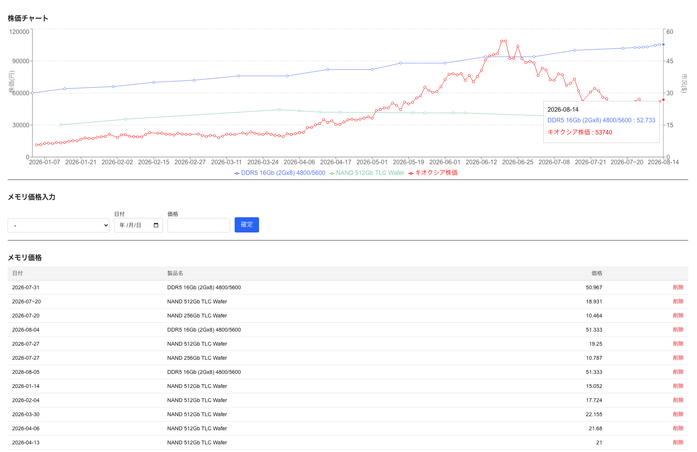

# mem-price-dashboard

DRAM/NAND メモリ市況（スポット/契約価格）と、キオクシア等の関連株価を
1つのチャートに重ねて監視する個人用ダッシュボード。

メモリ市況と半導体メーカーの株価の連動を、時系列で見比べることが目的。

自宅サーバにてAPI起動、systemd timerにて株価取得バッチ定期実行で運用。

## スクリーンショット



※ DDR5 の 2026-07-31 以前の値は推定値(傾向把握用)

## 主な機能

- 株価の自動取得（J-Quants API）→ SQLite への保存
- メモリ市況価格をフロントから手入力・一覧・削除
  - メモリ市況価格は [TrendForce](https://www.trendforce.com/) より取得。
  - 規約上スクレイピングは行えないので手入力
- 株価 × メモリ市況を2軸で重ねた時系列チャート（左軸=株価 / 右軸=市況）

## アーキテクチャ

Go のバックエンド（バッチ + HTTP API）と Next.js のフロントエンドで構成。

```
cmd/
  fetch/        株価取得バッチ（J-Quants → SQLite。systemd timerで定期実行）
  api/          HTTP API サーバ（SQLite の内容を JSON で配信）
internal/
  jquants/      J-Quants API クライアント
  store/        SQLite の読み書き（スキーマ所有）
web/            Next.js フロントエンド（App Router / TypeScript / Tailwind）
```

## 技術スタック

| 領域           | 技術                                                                     |
| -------------- | ------------------------------------------------------------------------ |
| バックエンド   | Go（標準ライブラリ中心）                                                 |
| DB             | SQLite（[modernc.org/sqlite](https://pkg.go.dev/modernc.org/sqlite)）    |
| フロントエンド | Next.js（App Router）/ React / TypeScript / Tailwind CSS                 |
| チャート       | Recharts ([https://recharts.github.io/](https://recharts.github.io/))    |
| データソース   | 株価: J-Quants API（自動取得）/ メモリ市況: TrendForce（規約上、手入力） |

## データモデル

- `products` … 製品マスタ（`product` 主キー、`category` = DRAM/NAND、`price_type` = spot/contract）
- `market_prices` … 価格の時系列（`(date, product)` 主キー、`product` は `products` への外部キー）
- `stock_prices` … 株価の時系列（`(code, date)` 主キー）

## API エンドポイント

| メソッド | パス                                     | 説明                             |
| -------- | ---------------------------------------- | -------------------------------- |
| GET      | `/api/prices?code=<code>`                | 指定銘柄の株価一覧               |
| GET      | `/api/products`                          | 製品マスタ一覧                   |
| POST     | `/api/products`                          | 製品を登録                       |
| GET      | `/api/market[?product=<name>]`           | 市況価格一覧（クエリ無しで全件） |
| POST     | `/api/market`                            | 市況価格を登録                   |
| DELETE   | `/api/market?date=<date>&product=<name>` | 市況価格を削除                   |

## TODO

- 決算発表日をチャートにマーク
- 財務・capex の取得と重ね表示
- 複数銘柄対応
- グラフの線の表示/非表示トグル
